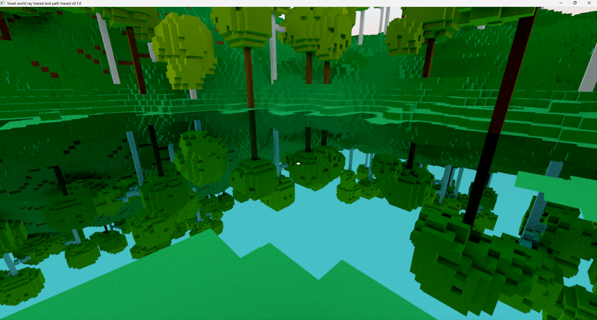

# voxel-ray-tracing:
A ray traced voxel world made with wgpu. 

This repo is a fork of [MasonFeurer/VoxelRayTracing](https://github.com/MasonFeurer/VoxelRayTracing) 
Specifically, I used the [Commit 583b610](https://github.com/MasonFeurer/VoxelRayTracing/tree/583b6109fcd6708b21c7db1f77590eca538cb41b) 

This fork does not use winit, but an experimental version of window and input management (crate voxel_winput), which is about 20 times faster than winit (not that it takes much…)

