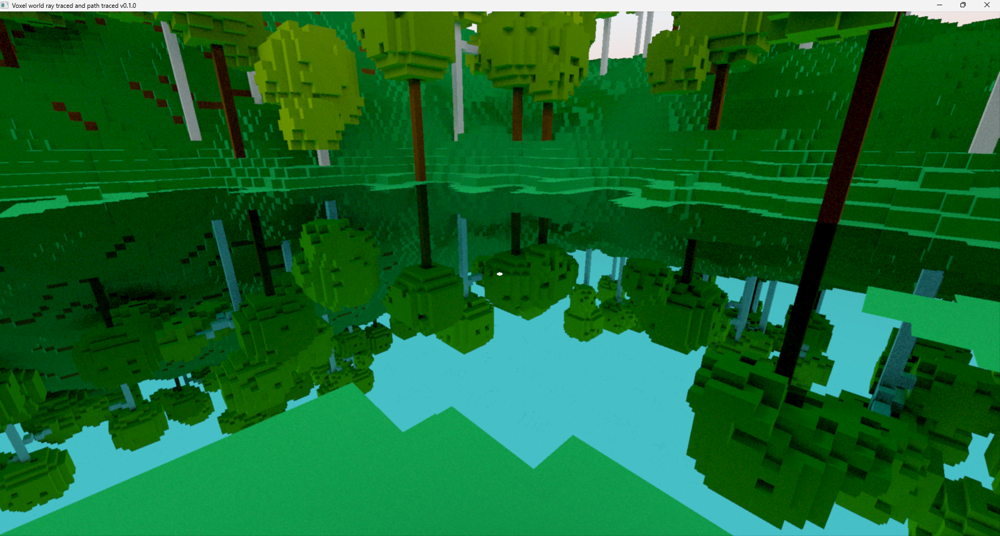

# voxel-ray-tracing:
A ray traced and path traced voxel world made with wgpu. 

This repo is a fork of [MasonFeurer/VoxelRayTracing](https://github.com/MasonFeurer/VoxelRayTracing) 
Specifically, I used the [commit 583b610](https://github.com/MasonFeurer/VoxelRayTracing/tree/583b6109fcd6708b21c7db1f77590eca538cb41b) 
If you are interested in this project, please check out the original repository. It contains further developments and is more complete than this fork. 

This fork does not use winit, but an experimental version of window and input management (crate voxel_winput, supports Windows only), which is about 2 times faster than winit.

